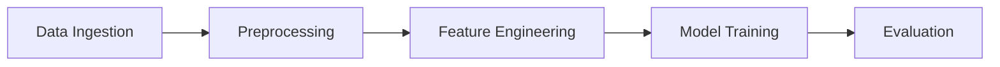

mlops-mini-project
==============================

a small mlops project

Project Organization
------------

    ├── LICENSE
    ├── Makefile           <- Makefile with commands like `make data` or `make train`
    ├── README.md          <- The top-level README for developers using this project.
    ├── data
    │   ├── external       <- Data from third party sources.
    │   ├── interim        <- Intermediate data that has been transformed.
    │   ├── processed      <- The final, canonical data sets for modeling.
    │   └── raw            <- The original, immutable data dump.
    │
    ├── docs               <- A default Sphinx project; see sphinx-doc.org for details
    │
    ├── models             <- Trained and serialized models, model predictions, or model summaries
    │
    ├── notebooks          <- Jupyter notebooks. Naming convention is a number (for ordering),
    │                         the creator's initials, and a short `-` delimited description, e.g.
    │                         `1.0-jqp-initial-data-exploration`.
    │
    ├── references         <- Data dictionaries, manuals, and all other explanatory materials.
    │
    ├── reports            <- Generated analysis as HTML, PDF, LaTeX, etc.
    │   └── figures        <- Generated graphics and figures to be used in reporting
    │
    ├── requirements.txt   <- The requirements file for reproducing the analysis environment, e.g.
    │                         generated with `pip freeze > requirements.txt`
    │
    ├── setup.py           <- makes project pip installable (pip install -e .) so src can be imported
    ├── src                <- Source code for use in this project.
    │   ├── __init__.py    <- Makes src a Python module
    │   │
    │   ├── data           <- Scripts to download or generate data
    │   │   └── make_dataset.py
    │   │
    │   ├── features       <- Scripts to turn raw data into features for modeling
    │   │   └── build_features.py
    │   │
    │   ├── models         <- Scripts to train models and then use trained models to make
    │   │   │                 predictions
    │   │   ├── predict_model.py
    │   │   └── train_model.py
    │   │
    │   └── visualization  <- Scripts to create exploratory and results oriented visualizations
    │       └── visualize.py
    │
    └── tox.ini            <- tox file with settings for running tox; see tox.readthedocs.io


--------

<p><small>Project based on the <a target="_blank" href="https://drivendata.github.io/cookiecutter-data-science/">cookiecutter data science project template</a>. #cookiecutterdatascience</small></p>


#  Commands and About the project:

### Project Setup Commands
```bash
# 1. Create project template
pip install cookiecutter
cookiecutter https://github.com/drivendata/cookiecutter-data-science
# Fill project details: tweet_emotion_classification

# 2. Cleanup template
cd tweet_emotion_classification
rm -rf data/external/* data/raw/* references/*

# 3. Initialize Git
git init
git add .
git commit -m "Initial project structure"

# 4. Create GitHub repo & push
gh repo create tweet_emotion_classification --public --push --source .
```

### DagsHub Setup (After creating repo on dagshub.com)
```bash
# 5. Configure MLflow tracking
cat > notebooks/dagshub_setup.py <<EOF
import os
import dagshub
import mlflow

dagshub.init(
    repo_owner="<YOUR_USERNAME>", 
    repo_name="tweet_emotion_classification",
    mlflow=True
)
mlflow.set_tracking_uri(os.environ['MLFLOW_TRACKING_URI'])
EOF

# Install dependencies
pip install dagshub mlflow
```

### DVC Pipeline Implementation
```bash
# 9-10. Initialize DVC & configure remote
dvc init
dvc remote add -d myremote s3://your-bucket/dvc-storage

# 11. Create pipeline stages
dvc stage add -n data_ingestion \
    -d src/data_ingestion.py -d data/raw \
    -o data/processed/ingested.csv \
    python src/data_ingestion.py

dvc stage add -n preprocessing \
    -d src/preprocessing.py -d data/processed/ingested.csv \
    -o data/processed/cleaned.csv \
    python src/preprocessing.py

dvc stage add -n feature_engineering \
    -d src/feature_engineering.py -d params.yaml \
    -d data/processed/cleaned.csv \
    -o data/features/features.csv \
    python src/feature_engineering.py

dvc stage add -n train \
    -d src/train.py -d data/features/features.csv \
    -o models/model.joblib \
    python src/train.py

dvc stage add -n evaluate \
    -d src/evaluate.py -d models/model.joblib \
    -o metrics/performance.json \
    python src/evaluate.py

# 12. Run pipeline
dvc repro
```

### AWS S3 Configuration
```bash
# 14. Configure AWS
pip install dvc-s3
aws configure
# Enter credentials when prompted

# Add data storage
dvc remote modify myremote endpointurl https://s3.amazonaws.com
dvc add data/raw
dvc push
```

---

## Comprehensive README.md

````markdown
# Tweet Emotion Classification

## Project Overview
Classify tweet emotions using NLP techniques and ML algorithms. Implements:
- BoW/TF-IDF feature extraction
- Logistic Regression/RandomForest/XGBoost
- Hyperparameter tuning
- DVC pipeline
- MLflow experiment tracking

## Project Structure
```
├── data
│   ├── raw              - Raw tweet data
│   ├── processed        - Cleaned data
│   └── features         - Engineered features
├── models               - Trained models
├── notebooks            - Experiment notebooks
├── flask-api
│   ├── app.py
│   └── preprocessing_utility.py
├── src
│   ├── data_ingestion.py
│   ├── preprocessing.py
│   ├── feature_engineering.py
│   ├── train.py
│   └── evaluate.py
├── params.yaml          - Pipeline parameters
├── dvc.yaml             - DVC pipeline
└── requirements.txt
```

## Setup
```bash
git clone https://github.com/<username>/tweet_emotion_classification.git
cd tweet_emotion_classification
pip install -r requirements.txt
```

## Data Pipeline


### Run Pipeline
```bash
dvc repro  # Execute full pipeline
dvc metrics show  # View performance metrics
```

## Experiment Tracking
1. **Baseline Model (Exp1)**: 
   - BoW + Logistic Regression
   - `notebooks/exp1-baseline.ipynb`
   
2. **Feature Comparison (Exp2)**:
   - Compare BoW vs TF-IDF
   - Multiple algorithms
   - `notebooks/exp2-feature-comparison.ipynb`
   
3. **Hyperparameter Tuning (Exp3)**:
   - Optimize best model
   - `notebooks/exp3-hyperparameter-tuning.ipynb`

View experiments on [DagsHub](https://dagshub.com/<username>/tweet_emotion_classification)

## Deployment
```python
# app.py
from flask import Flask
import joblib

app = Flask(__name__)
model = joblib.load('models/model.joblib')

@app.post('/predict')
def predict():
    text = request.json['text']
    # Preprocessing logic
    prediction = model.predict([text])
    return {'emotion': prediction[0]}
```

Run with:
```bash
python app.py
```

## DVC Configuration
```bash
# Add data storage
dvc remote add -d myremote s3://your-bucket/dvc-storage

# Pull data
dvc pull
```

## Contributors
[Your Name]
````

### Key Implementation Notes:
1. **Experiment Workflow**:
   - Exp1: Baseline with BoW + LogisticRegression
   - Exp2: Compare feature extraction methods (BoW vs TF-IDF) with multiple classifiers
   - Exp3: Hyperparameter tuning for best combination

2. **DVC Pipeline**:
   - Use `params.yaml` for all configurable parameters
   - MLflow logging integrated in `evaluate.py`:
     ```python
     import mlflow
     mlflow.log_metrics({"f1": f1_score})
     mlflow.log_artifact("models/model.joblib")
     ```

3. **Model Serving**:
   - Fetch production model from DagsHub:
     ```python
     import dagshub
     dagshub.content.get_model("model.joblib", path="models/production")
     ```

4. **Requirements.txt**:
   ```
   scikit-learn==1.2.2
   pandas==2.0.3
   numpy==1.24.3
   dvc[s3]==3.0.0
   mlflow==2.4.1
   dagshub==0.3.14
   flask==2.3.2
   nltk==3.8.1
   xgboost==1.7.5
   ```

This setup provides complete reproducibility from experimentation to deployment with DVC pipeline management and MLflow tracking through DagsHub.